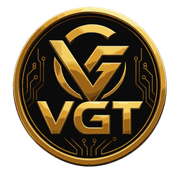

# VGT Project

  

<h1 align="center">VGT Token</h1>

Digital Asset on the Stellar Network

---

## Overview

VGT is a digital asset built on the Stellar Network with a focus on fast, secure, and low-cost transactions. The project aims to provide a scalable asset for digital payments and ecosystem development.

---

## Token Information

| Item | Value |
|------|-------|
| Token Name | VGT |
| Asset Code | VGT |
| Network | Stellar Public Network |
| Total Supply | 16,000,000 VGT |
| Issuer | GC53AK2JTSXGRQIJCOKLPQY7AFM22S52MA2XSO4BDB4IJYK237AZBUCH |

---

## Official Links

**Website**

https://rts.web.id

**Stellar TOML**

https://rts.web.id/.well-known/stellar.toml

---

---

## Features

- Stellar Network Asset
- Fast Transactions
- Low Network Fees
- Open Source Metadata
- SEP-1 Compatible
- Trustline Supported

---

## Contact

Website:
https://rts.web.id

---

©️ 2026 VGT Project. All Rights Reserved.
